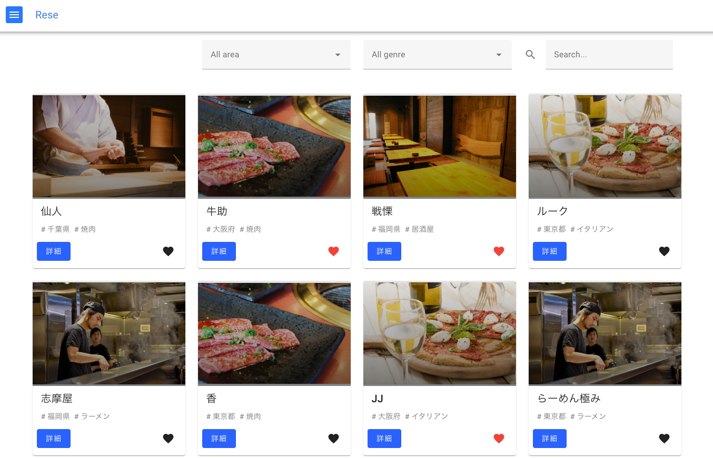

# アプリケーション名

### 飲食店予約管理システム



### サービス名

Rese

### 概要説明

##### 一般ユーザー

登録されている飲食店の検索・予約・お気に入り登録・決済を利用するためのアプリケーション

##### 店舗代表者ユーザー

店舗の登録・編集・予約確認・お知らせメール送信を利用するためのアプリケーション

##### 管理者ユーザー

店舗代表者の作成・編集・お知らせメール送信を利用するためのアプリケーション

## 作成した目的

(Advance ターム)

外部の飲食店予約サービスは手数料を取られるので自社で予約サービスを持ちたい。

[要件定義書](https://docs.google.com/spreadsheets/d/1IF4y5eBm6zgM_64wsPAc_UwLsdiPoZTR2HceWD0icgg/edit#gid=509071084)

## 他のリポジトリ

バックエンドの API の実装を Laravel で行い
フロントエンドの実装は Vue.js で実装する

[Vue.js(フロントエンド)のリポジトリ](https://github.com/riki-fuku/rese-vue-app)

## アプリケーション URL デプロイの URL を貼り付る

#### 本番環境(一般ユーザー)

http://rese-vue-app.s3-website-ap-northeast-1.amazonaws.com

| ユーザー名 | メールアドレス | パスワード |
| ---------- | -------------- | ---------- |
| user1      | user1@mail.com | hogehoge   |

#### 本番環境(一般ユーザー)

http://rese-vue-app.s3-website-ap-northeast-1.amazonaws.com/agent/

| ユーザー名 | メールアドレス  | パスワード |
| ---------- | --------------- | ---------- |
| agent1     | agent1@mail.com | hogehoge   |

#### 本番環境(一般ユーザー)

http://rese-vue-app.s3-website-ap-northeast-1.amazonaws.com/admin/

| ユーザー名 | メールアドレス  | パスワード |
| ---------- | --------------- | ---------- |
| admin1     | admin1@mail.com | hogehoge   |

#### 本番環境(メール:MailHog)
http://54.157.248.27:8025/

## 機能一覧

##### 一般ユーザー

登録されている飲食店の検索・予約・お気に入り登録・決済を利用するためのアプリケーション

| 機能一覧                         |
| -------------------------------- |
| ユーザー登録                     |
| ログイン・ログアウト             |
| 店舗検索                         |
| 店舗予約の確認・変更・削除       |
| 店舗お気に入りの確認・登録・解除 |
| 来店時の QR コード表示           |
| 店舗評価                         |
| 決済                             |

##### 店舗代表者ユーザー

| 機能一覧                       |
| ------------------------------ |
| ログイン・ログアウト           |
| 店舗情報の作成・編集           |
| 店舗に対する予約確認           |
| 店舗に対する予約詳細・来店更新 |
| 決済用のの QR コード表示       |
| お知らせメール送信             |

##### 管理者ユーザー

| 機能一覧                              |
| ------------------------------------- |
| ログイン・ログアウト                  |
| 店舗代表者の作成・編集・有効化/無効化 |
| お知らせメール送信                    |

## 使用技術(実行環境)

- Laravel 8.83.27
- php 8.2.1
- mysql 8.0.26
- nginx 1.21.1

## テーブル設計

[テーブル設計書](https://docs.google.com/spreadsheets/d/1IF4y5eBm6zgM_64wsPAc_UwLsdiPoZTR2HceWD0icgg/edit#gid=1635115377)

## ER 図

[ER 図](https://docs.google.com/spreadsheets/d/1IF4y5eBm6zgM_64wsPAc_UwLsdiPoZTR2HceWD0icgg/edit#gid=320603785)

## 環境構築

以下の手順で環境を構築してください。

1. Git リポジトリをクローンします。

```
git clone git@github.com:riki-fuku/rese-laravel-app.git
```

2. Docker と Docker Compose をインストールします。

インストール済みの場合は次に進みます

3. プロジェクトのルートディレクトリに移動します。

```
cd rese-laravel-app
```

4. `.env.example` ファイルをコピーして `.env` ファイルを作成します。

```
cd src
cp .env.example .env
```

`.env` ファイルに必要な環境変数を設定します。(基本ローカルでは不要)

5. docker 起動

```
docker-compose up -d --build
```

これにより、Laravel アプリケーション、MySQL データベース、Nginx ウェブサーバーが起動します。

6. compose のインストール

```
docker-compose up -d --build
```

7. ブラウザで以下の URL にアクセスします。

```
http://localhost
```

Laravel のウェルカムページが表示されれば、環境構築は成功です。

8. 必要に応じて、データベースの接続情報やその他の設定を変更します。

Laravel の設定ファイルは `rese-laravel-app/.env` にあります。

MySQL の設定ファイルは `rese-laravel-app/docker-compose.yml` にあります。

Nginx の設定ファイルは `rese-laravel-app/nginx/default.conf` にあります。

変更後は、Docker コンテナを再起動する必要があります。

```
docker-compose restart
```

環境構築が完了したら、Laravel アプリケーションを開発する準備が整いました。

Laravel アプリケーションは API の機能を提供するため、ウェルカムページ以外の画面はありません。
API を実行したい際は Postman 等のツールを利用してください。

画面の表示を行いたい場合は Vue.js のリポジトリを確認してください。

[Vue.js(フロントエンド)のリポジトリ](https://github.com/riki-fuku/rese-vue-app)

## 参考

[福島さん Web 開発上級 生徒様用案件シート Ver.2.0](https://docs.google.com/spreadsheets/d/1IF4y5eBm6zgM_64wsPAc_UwLsdiPoZTR2HceWD0icgg/edit#gid=935968078)
